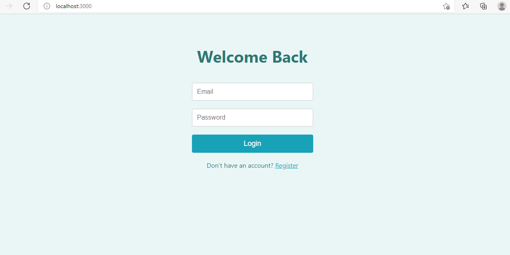
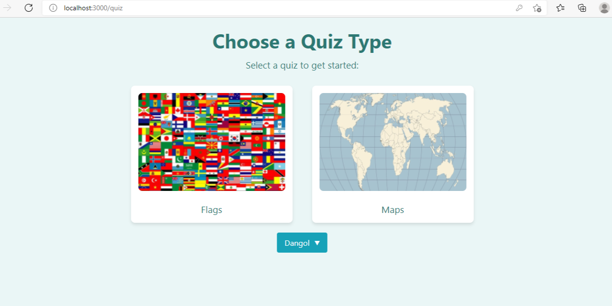
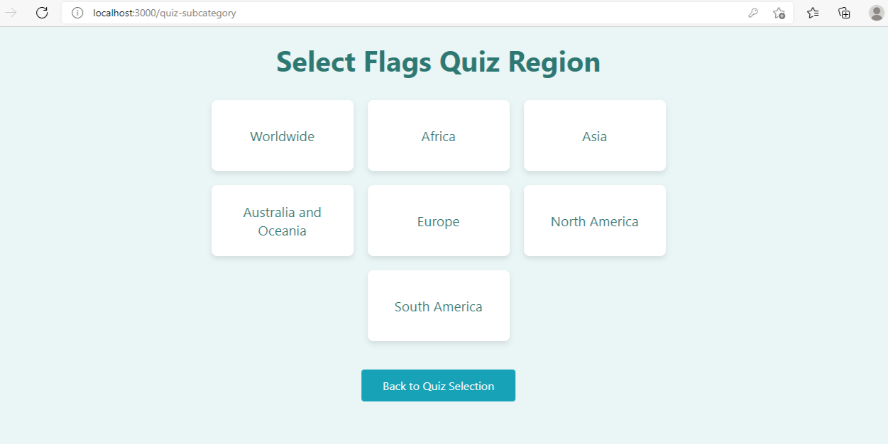
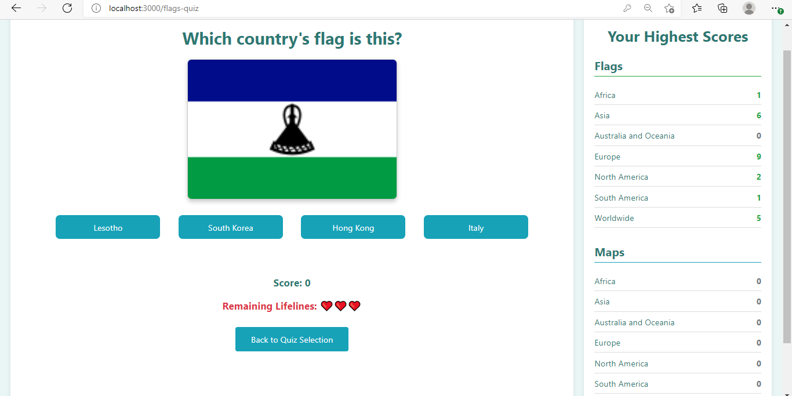

# QuizApp - Country Flags & Maps Quiz Web Application

QuizApp is an interactive MERN stack web application that allows users to test their knowledge of world geography by playing quizzes on country flags and maps. Features include user authentication, personalized score tracking, and a rich, responsive UI.

---

## Table of Contents

* [Features](#features)
* [Tech Stack](#tech-stack)
* [Getting Started](#getting-started)

  * [Prerequisites](#prerequisites)
  * [Installation](#installation)
  * [Environment Variables](#environment-variables)
  * [Running Locally](#running-locally)
    
* [Project Structure](#project-structure)
* [API Endpoints](#api-endpoints)
* [Contributing](#contributing)
* [License](#license)
* [Acknowledgements](#acknowledgements)

---

## Features

* **User Authentication:** Secure registration and login with JWT-based sessions.
* **Quizzes on Flags & Maps:** Choose between flag identification or map-based country quizzes.
* **Dynamic Questions:** Extensive question bank loaded dynamically from the database.
* **Score Tracking:** View and compare your high scores across quiz categories.
* **Responsive Design:** Mobile-first UI for an optimal experience on any device.

---

## Tech Stack

* **Frontend:** React, React Router, Context API
* **Styling:** CSS Modules
* **Backend:** Node.js, Express
* **Database:** MongoDB, Mongoose ODM
* **Authentication:** JSON Web Tokens (JWT)

---

## Getting Started

### Prerequisites

* [Node.js](https://nodejs.org/) v14 or above
* [npm](https://www.npmjs.com/) v6 or above
* [MongoDB](https://www.mongodb.com/) (local or Atlas cluster)

### Installation

1. **Clone the repository**

   ```bash
   git clone https://github.com/yourusername/quiz-app.git
   cd quiz-app
   ```

2. **Install server dependencies**

   ```bash
   cd server
   npm install
   ```

3. **Install client dependencies**

   ```bash
   cd ../
   npm install
   ```

### Environment Variables

Create a `.env` file in the **server** directory with the following keys:

```env
MONGO_URI=your_mongodb_connection_string
JWT_SECRET=your_jwt_secret_key
PORT=5000
```

### Running Locally

1. **Start the backend server**

   ```bash
   cd server
   npm run dev
   ```

2. **Start the React development server**

   ```bash
   cd ../
   npm start
   ```

3. **Open your browser** and navigate to `http://localhost:3000`

---

## Screenshots






---

## Project Structure

```bash
quiz-app/
├─ server/               # Express server and API routes
│  ├─ models/            # Mongoose schemas (User, Question, Country)
│  ├─ routes/            # Authentication, questions, countries, scores
│  └─ index.js           # App entry point
├─ public/               # Public assets and HTML template
├─ src/                  # React client source code
│  ├─ components/        # Quiz components (QuizLogic, OptionButton, etc.)
│  ├─ context/           # React Context for user state
│  └─ data/              # Static question definitions (fallback)
├─ .gitignore
├─ package.json
└─ README.md
```

---

## API Endpoints

### Authentication

* **POST** `/api/auth/register` — Register new user
* **POST** `/api/auth/login` — Login user and return JWT

### Questions & Countries

* **GET** `/api/questions` — Fetch quiz questions
* **GET** `/api/countries` — Fetch country metadata

### Scores

* **GET** `/api/scores/user/:userId` — Get user scores
* **POST** `/api/scores` — Submit a new score record

---

## Contributing

Contributions are welcome! Please follow these steps:

1. Fork the repository
2. Create a new branch: `git checkout -b feature/YourFeatureName`
3. Commit your changes: `git commit -m 'Add some feature'`
4. Push to the branch: `git push origin feature/YourFeatureName`
5. Open a Pull Request

---

## License

This project is licensed under the MIT License. See the [LICENSE](LICENSE) file for details.

---

## Acknowledgements

* Inspired by educational quiz platforms
* Icons and images from public domain sources
* Built with [Create React App](https://github.com/facebook/create-react-app) and Express
